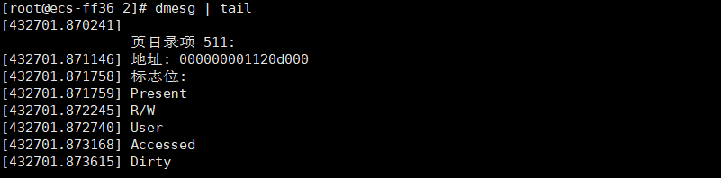

# Linux实验
### 实验内容:  
[1. MBR中磁盘分区表解析(实验一)](#1mbr中磁盘分区表解析)  
[2.当前进程页表目录获取(实验二)](#2当前进程页表目录获取)  
[3.全局描述符表获取(实验三)](#3全局描述符表获取)

### 项目说明:  
每个实验均保存在对应序号的文件夹,使用git获取:  
```bash
git clone https://github.com/mywhu9/myLinux
```
### 准备工作:  
本实验在华为云ESC上,使用openEuler开源操作系统
使用命令行(需要先安装OpenSSH组件)执行ssh 命令或使用专业软件(如XShell)连接  
```bash
ssh username@your-vm-ip-address
```
注意切换root账号及更新yum
```bash
sudo -i
```
```bash
yum update
```

多数使用C语言编写,需要先安装gcc
```bash
sudo yum install -y gcc
```
验证gcc版本  
```bash
gcc --version
```
同时安装make工具
```bash
sudo yum install make
```
## 1.MBR中磁盘分区表解析

### 代码说明

以下代码用于解析MBR(主引导记录)中的磁盘分区表，并打印每个分区的信息。
### 使用说明
使用"1"文件夹下的MBR.c源文件,编译运行即可
```bash
gcc MBR.c -o MBR
```
```bash
sudo ./MBR
```
### 源代码
```c
#include <stdio.h>
#include <stdlib.h>
#include <stdint.h>

#define MBR_SIZE 512
#define PARTITION_TABLE_OFFSET 446
#define NUM_PARTITIONS 4
#define PARTITION_ENTRY_SIZE 16

#pragma pack(push, 1)  // 以1字节对齐结构体
typedef struct {
    uint8_t  status;        // 启动状态
    uint8_t  start_head;    // 起始磁头
    uint8_t  start_sector;  // 起始扇区
    uint8_t  start_cylinder; // 起始气缸
    uint8_t  type;          // 分区类型
    uint8_t  end_head;      // 结束磁头
    uint8_t  end_sector;    // 结束扇区
    uint8_t  end_cylinder;  // 结束气缸
    uint32_t start_lba;     // 分区起始扇区（逻辑块地址）
    uint32_t size;          // 分区大小（以扇区为单位）
} PartitionEntry;

typedef struct {
    uint8_t boot_code[446]; // 引导代码
    PartitionEntry partitions[NUM_PARTITIONS]; // 分区表
    uint16_t signature;      // MBR签名（0x55AA）
} MBR;
#pragma pack(pop)

void print_partition_info(const PartitionEntry *entry, int index) {
    printf("分区 %d:\n", index + 1);
    printf("  启动状态: %u\n", entry->status);
    printf("  起始地址: %u\n", entry->start_lba);
    printf("  大小: %u 扇区\n", entry->size);
    printf("  类型: %u\n", entry->type);
    printf("  结束气缸: %u\n", entry->end_cylinder);
    printf("  结束扇区: %u\n", entry->end_sector);
    printf("  结束磁头: %u\n", entry->end_head);
}

int main() {
    FILE *disk = fopen("/dev/vda", "rb"); // 修改为实际磁盘路径
    if (!disk) {
        perror("无法打开磁盘");
        return 1;
    }

    MBR mbr;
    fread(&mbr, sizeof(MBR), 1, disk);
    fclose(disk);

    // 验证MBR签名
    if (mbr.signature != 0xAA55) {
        printf("无效的MBR签名\n");
        return 1;
    }

    // 打印分区信息
    for (int i = 0; i < NUM_PARTITIONS; i++) {
        print_partition_info(&mbr.partitions[i], i);
    }

    return 0;
}

```
### 实验结果
  

[回到顶部](#linux实验)  

## 2.当前进程页表目录获取
### 源代码
```c
#include <linux/module.h>      // 引入模块相关的头文件
#include <linux/kernel.h>      // 引入内核相关的头文件
#include <linux/init.h>        // 引入初始化和退出相关的头文件
#include <linux/sched.h>       // 引入进程调度相关的头文件
#include <linux/mm.h>          // 引入内存管理相关的头文件
#include <linux/mm_types.h>    // 引入内存类型相关的头文件
#include <asm/io.h>            // 引入输入输出相关的汇编头文件
#include <linux/uaccess.h>     // 引入用户空间访问相关的头文件

#define PAGE_DIR_MASK 0xFFFFF000UL  // 定义页目录地址掩码，用于获取页目录项的地址
#define PDE_PRESENT    0x1           // 页目录项存在标志
#define PDE_RW        0x2             // 可读写标志
#define PDE_USER      0x4             // 用户可访问标志
#define PDE_PWT       0x8             // 页写-through标志
#define PDE_PCD       0x10            // 页缓存禁用标志
#define PDE_ACCESSED  0x20            // 已访问标志
#define PDE_DIRTY     0x40            // 脏页标志
#define PDE_4MB       0x80            // 4MB 页面标志
#define PDE_GLOBAL    0x100           // 全局页标志

// 函数：读取CR3寄存器值
static unsigned long read_cr3(void)
{
    unsigned long cr3; // 存储CR3寄存器的值
    asm volatile("mov %%cr3, %0" : "=r"(cr3) : : "memory"); // 使用汇编指令读取CR3寄存器
    return cr3; // 返回CR3的值
}

// 函数：打印页目录项的标志
static void print_pde_flags(unsigned long pde)
{
    pr_info("标志位: "); // 打印提示信息
    // 检查并打印页目录项的各个标志位
    if (pde & PDE_PRESENT)   pr_info("Present ");
    if (pde & PDE_RW)        pr_info("R/W ");
    if (pde & PDE_USER)      pr_info("User ");
    if (pde & PDE_PWT)       pr_info("PWT ");
    if (pde & PDE_PCD)       pr_info("PCD ");
    if (pde & PDE_ACCESSED)  pr_info("Accessed ");
    if (pde & PDE_DIRTY)     pr_info("Dirty ");
    if (pde & PDE_4MB)       pr_info("4MB ");
    if (pde & PDE_GLOBAL)    pr_info("Global ");
    pr_info("\n"); // 换行
}

// 初始化函数：打印当前进程的页表目录信息
static int __init print_page_directory_init(void)
{
    unsigned long cr3; // 存储CR3寄存器的值
    pgd_t *pgd; // 指向页目录的指针
    int i; // 循环索引
    struct task_struct *task = current; // 获取当前进程的task_struct
    struct mm_struct *mm; // 指向内存描述符的指针
    unsigned long entry; // 存储页目录项的值

    mm = task->mm; // 获取当前进程的内存管理信息
    if (!mm) { // 如果没有内存管理信息
        mm = task->active_mm; // 获取活动的内存管理信息
        if (!mm) { // 如果仍然没有
            pr_err("无法访问内存描述符\n"); // 打印错误信息
            return -EINVAL; // 返回无效参数错误
        }
    }

    cr3 = read_cr3(); // 读取CR3寄存器的值
    pgd = mm->pgd; // 获取页目录基地址

    // 打印当前进程的页表目录信息
    pr_info("当前进程页表目录信息:\n");
    pr_info("CR3寄存器值: 0x%lx\n", cr3);
    pr_info("页目录基地址: %px\n", pgd);
    pr_info("当前进程: %s (PID: %d)\n", task->comm, task->pid);

    // 遍历页目录项
    for (i = 0; i < PTRS_PER_PGD; i++) {
        entry = native_pgd_val(pgd[i]); // 获取页目录项的值
        if (entry & PDE_PRESENT) { // 如果页目录项存在
            pr_info("\n页目录项 %d:\n", i); // 打印页目录项的索引
            pr_info("地址: %px\n", (void *)(entry & PAGE_DIR_MASK)); // 打印页目录项的地址
            print_pde_flags(entry); // 打印页目录项的标志
        }
    }

    return 0; // 返回成功
}

// 卸载函数：打印模块卸载信息
static void __exit print_page_directory_exit(void)
{
    pr_info("页表目录信息打印模块已卸载\n"); // 打印卸载信息
}

// 定义模块的初始化和卸载函数
module_init(print_page_directory_init);
module_exit(print_page_directory_exit);

// 定义模块的许可证、作者、描述和版本
MODULE_LICENSE("GPL");
MODULE_AUTHOR("Your Name");
MODULE_DESCRIPTION("打印当前进程页表目录信息 - OpenEuler版本");
MODULE_VERSION("1.0");

```
Makefile文件见项目文件夹"2"
### 使用方法
首先安装正确的内核头文件  
```bash
sudo dnf install kernel-headers kernel-devel
```  
"2"文件夹下有PDE.c和Makefile两个文件
首先编译源代码
```bash
make
```
加载得到的模块
```bash
sudo insmod PDE.ko
```
执行后，可以使用以下命令检查模块是否已成功加载:
```bash
lsmod | grep PDE
```
得到的结果为  

查看输出  
```bash
dmesg | tail
```
结果为  

实验完成后，通过下列命令卸载模块
```bash
sudo rmmod PDE
```
  
[回到顶部](#linux实验)  

## 3.全局描述符表获取

### 源代码
```c
#include <stdio.h>       // 引入标准输入输出库
#include <stdint.h>      // 引入整数类型定义库

// 定义全局描述符表（GDT）项的结构
struct gdt_descriptor {
    uint16_t limit_low;      // 段限长低16位
    uint16_t base_low;       // 段基地址低16位
    uint8_t  base_middle;    // 段基地址中8位
    uint8_t  access;         // 段访问字节
    uint8_t  granularity;    // 段粒度和高4位的段限长
    uint8_t  base_high;      // 段基地址高8位
} __attribute__((packed)); // 确保结构体没有填充字节

// 定义GDT寄存器的结构
struct gdtr {
    uint16_t limit;          // GDT的大小（字节数）
    uint32_t base;           // GDT的基地址
} __attribute__((packed)); // 确保结构体没有填充字节

// 打印GDT信息的函数
void print_gdt_info() {
    struct gdtr gdtr_value;  // 存储GDT寄存器的值
    struct gdt_descriptor *gdt; // 指向GDT的指针
    
    // 使用汇编指令读取GDT寄存器的值
    __asm__ volatile ("sgdt %0" : "=m" (gdtr_value));
    
    // 使用uintptr_t类型进行中间转换，确保指针类型安全
    uintptr_t gdt_base = (uintptr_t)gdtr_value.base; 
    gdt = (struct gdt_descriptor *)gdt_base; // 将GDT基地址转换为gdt_descriptor指针
    
    // 计算GDT表项的数量
    int entries = (gdtr_value.limit + 1) / sizeof(struct gdt_descriptor);
    
    // 打印GDT基本信息
    printf("GDT信息:\n");
    printf("GDT基地址: 0x%08X\n", gdtr_value.base);
    printf("GDT界限: %d\n", gdtr_value.limit);
    printf("GDT表项数量: %d\n\n", entries);
    
    // 遍历并打印每个GDT表项的信息
    for (int i = 0; i < entries; i++) {
        // 计算段基地址
        uint32_t base = gdt[i].base_low | 
                       ((uint32_t)gdt[i].base_middle << 16) |
                       ((uint32_t)gdt[i].base_high << 24);
        
        // 计算段限长
        uint32_t limit = gdt[i].limit_low |
                        ((uint32_t)(gdt[i].granularity & 0x0F) << 16);
        
        // 如果设置了粒度标志，调整段限长
        if (gdt[i].granularity & 0x80) {
            limit = (limit << 12) + 0xFFF; // 将限长转为页面数量
        }
        
        // 打印每个GDT表项的信息
        printf("GDT[%d]:\n", i);
        printf("  基地址: 0x%08X\n", base); // 打印基地址
        printf("  段长度: 0x%08X\n", limit); // 打印段限长
        printf("  特权级: %d\n", (gdt[i].access >> 5) & 0x03); // 打印特权级
        printf("  类型: %s\n", (gdt[i].access & 0x10) ? "代码段" : "数据段"); // 打印段类型
        printf("\n");
    }
}

// 主函数
int main() {
    print_gdt_info(); // 调用打印GDT信息的函数
    return 0; // 返回成功
}

```
### 使用说明
与实验一相同，编译后运行即可
```bash
gcc GDT.c -o GDT
```
```bash
./GDT
```
得到的结果为


[回到顶部](#linux实验)  