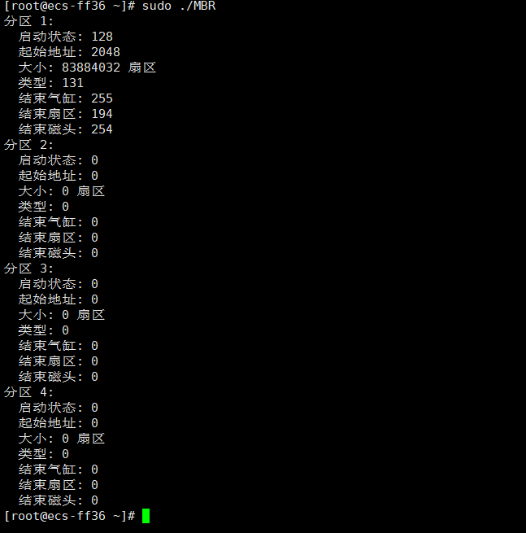
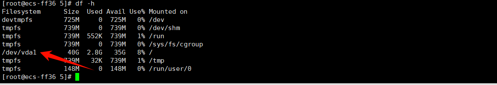

<div style="text-align: center;">

# Linux实验

</div>


<div align=center></div>


### 实验内容:  
[1. MBR中磁盘分区表解析(实验1)](#1mbr中磁盘分区表解析)  
[2.当前进程页表目录获取(实验2)](#2当前进程页表目录获取)  
[3.全局描述符表获取(实验3)](#3全局描述符表获取)  
[4.访问所有任务（进程）(实验6)](#4访问所有任务进程)  
[5.文件系统磁盘布局解析(实验9)](#5文件系统磁盘布局解析)

### 项目说明:  
每个实验均保存在对应序号的文件夹,使用git获取:  
```bash
git clone https://github.com/mywhu9/myLinux
```
### 准备工作:  
本实验在华为云ESC上,使用openEuler开源操作系统
使用命令行(需要先安装OpenSSH组件)执行ssh 命令或使用专业软件(如XShell)连接  
```bash
ssh username@your-vm-ip-address
```
注意切换root账号及更新yum
```bash
sudo -i
```
```bash
yum update
```

多数使用C语言编写,需要先安装gcc
```bash
sudo yum install -y gcc
```
验证gcc版本  
```bash
gcc --version
```
同时安装make工具
```bash
sudo yum install make
```
## 1.MBR中磁盘分区表解析

### 代码说明

以下代码用于解析MBR(主引导记录)中的磁盘分区表，并打印每个分区的信息。
### 使用说明
使用"1"文件夹下的MBR.c源文件,编译运行即可
```bash
gcc MBR.c -o MBR
```
```bash
sudo ./MBR
```

---

<details>
<summary><em>MBR.c</em></summary>

```c
#include <stdio.h>
#include <stdlib.h>
#include <stdint.h>

#define MBR_SIZE 512
#define PARTITION_TABLE_OFFSET 446
#define NUM_PARTITIONS 4
#define PARTITION_ENTRY_SIZE 16

#pragma pack(push, 1)  // 以1字节对齐结构体
typedef struct {
    uint8_t  status;        // 启动状态
    uint8_t  start_head;    // 起始磁头
    uint8_t  start_sector;  // 起始扇区
    uint8_t  start_cylinder; // 起始气缸
    uint8_t  type;          // 分区类型
    uint8_t  end_head;      // 结束磁头
    uint8_t  end_sector;    // 结束扇区
    uint8_t  end_cylinder;  // 结束气缸
    uint32_t start_lba;     // 分区起始扇区（逻辑块地址）
    uint32_t size;          // 分区大小（以扇区为单位）
} PartitionEntry;

typedef struct {
    uint8_t boot_code[446]; // 引导代码
    PartitionEntry partitions[NUM_PARTITIONS]; // 分区表
    uint16_t signature;      // MBR签名（0x55AA）
} MBR;
#pragma pack(pop)

void print_partition_info(const PartitionEntry *entry, int index) {
    printf("分区 %d:\n", index + 1);
    printf("  启动状态: %u\n", entry->status);
    printf("  起始地址: %u\n", entry->start_lba);
    printf("  大小: %u 扇区\n", entry->size);
    printf("  类型: %u\n", entry->type);
    printf("  结束气缸: %u\n", entry->end_cylinder);
    printf("  结束扇区: %u\n", entry->end_sector);
    printf("  结束磁头: %u\n", entry->end_head);
}

int main() {
    FILE *disk = fopen("/dev/vda", "rb"); // 修改为实际磁盘路径
    if (!disk) {
        perror("无法打开磁盘");
        return 1;
    }

    MBR mbr;
    fread(&mbr, sizeof(MBR), 1, disk);
    fclose(disk);

    // 验证MBR签名
    if (mbr.signature != 0xAA55) {
        printf("无效的MBR签名\n");
        return 1;
    }

    // 打印分区信息
    for (int i = 0; i < NUM_PARTITIONS; i++) {
        print_partition_info(&mbr.partitions[i], i);
    }

    return 0;
}

```

</details>


---

### 实验结果
  

[回到顶部](#linux实验)  

## 2.当前进程页表目录获取


---

<details>
<summary><em>PDE.c</em></summary>

```c
#include <linux/module.h>      // 引入模块相关的头文件
#include <linux/kernel.h>      // 引入内核相关的头文件
#include <linux/init.h>        // 引入初始化和退出相关的头文件
#include <linux/sched.h>       // 引入进程调度相关的头文件
#include <linux/mm.h>          // 引入内存管理相关的头文件
#include <linux/mm_types.h>    // 引入内存类型相关的头文件
#include <asm/io.h>            // 引入输入输出相关的汇编头文件
#include <linux/uaccess.h>     // 引入用户空间访问相关的头文件

#define PAGE_DIR_MASK 0xFFFFF000UL  // 定义页目录地址掩码，用于获取页目录项的地址
#define PDE_PRESENT    0x1           // 页目录项存在标志
#define PDE_RW        0x2             // 可读写标志
#define PDE_USER      0x4             // 用户可访问标志
#define PDE_PWT       0x8             // 页写-through标志
#define PDE_PCD       0x10            // 页缓存禁用标志
#define PDE_ACCESSED  0x20            // 已访问标志
#define PDE_DIRTY     0x40            // 脏页标志
#define PDE_4MB       0x80            // 4MB 页面标志
#define PDE_GLOBAL    0x100           // 全局页标志

// 函数：读取CR3寄存器值
static unsigned long read_cr3(void)
{
    unsigned long cr3; // 存储CR3寄存器的值
    asm volatile("mov %%cr3, %0" : "=r"(cr3) : : "memory"); // 使用汇编指令读取CR3寄存器
    return cr3; // 返回CR3的值
}

// 函数：打印页目录项的标志
static void print_pde_flags(unsigned long pde)
{
    pr_info("标志位: "); // 打印提示信息
    // 检查并打印页目录项的各个标志位
    if (pde & PDE_PRESENT)   pr_info("Present ");
    if (pde & PDE_RW)        pr_info("R/W ");
    if (pde & PDE_USER)      pr_info("User ");
    if (pde & PDE_PWT)       pr_info("PWT ");
    if (pde & PDE_PCD)       pr_info("PCD ");
    if (pde & PDE_ACCESSED)  pr_info("Accessed ");
    if (pde & PDE_DIRTY)     pr_info("Dirty ");
    if (pde & PDE_4MB)       pr_info("4MB ");
    if (pde & PDE_GLOBAL)    pr_info("Global ");
    pr_info("\n"); // 换行
}

// 初始化函数：打印当前进程的页表目录信息
static int __init print_page_directory_init(void)
{
    unsigned long cr3; // 存储CR3寄存器的值
    pgd_t *pgd; // 指向页目录的指针
    int i; // 循环索引
    struct task_struct *task = current; // 获取当前进程的task_struct
    struct mm_struct *mm; // 指向内存描述符的指针
    unsigned long entry; // 存储页目录项的值

    mm = task->mm; // 获取当前进程的内存管理信息
    if (!mm) { // 如果没有内存管理信息
        mm = task->active_mm; // 获取活动的内存管理信息
        if (!mm) { // 如果仍然没有
            pr_err("无法访问内存描述符\n"); // 打印错误信息
            return -EINVAL; // 返回无效参数错误
        }
    }

    cr3 = read_cr3(); // 读取CR3寄存器的值
    pgd = mm->pgd; // 获取页目录基地址

    // 打印当前进程的页表目录信息
    pr_info("当前进程页表目录信息:\n");
    pr_info("CR3寄存器值: 0x%lx\n", cr3);
    pr_info("页目录基地址: %px\n", pgd);
    pr_info("当前进程: %s (PID: %d)\n", task->comm, task->pid);

    // 遍历页目录项
    for (i = 0; i < PTRS_PER_PGD; i++) {
        entry = native_pgd_val(pgd[i]); // 获取页目录项的值
        if (entry & PDE_PRESENT) { // 如果页目录项存在
            pr_info("\n页目录项 %d:\n", i); // 打印页目录项的索引
            pr_info("地址: %px\n", (void *)(entry & PAGE_DIR_MASK)); // 打印页目录项的地址
            print_pde_flags(entry); // 打印页目录项的标志
        }
    }

    return 0; // 返回成功
}

// 卸载函数：打印模块卸载信息
static void __exit print_page_directory_exit(void)
{
    pr_info("页表目录信息打印模块已卸载\n"); // 打印卸载信息
}

// 定义模块的初始化和卸载函数
module_init(print_page_directory_init);
module_exit(print_page_directory_exit);

// 定义模块的许可证、作者、描述和版本
MODULE_LICENSE("GPL");
MODULE_AUTHOR("Your Name");
MODULE_DESCRIPTION("打印当前进程页表目录信息 - OpenEuler版本");
MODULE_VERSION("1.0");

```

</details>

---

Makefile文件见项目文件夹"2"
### 使用方法
首先安装正确的内核头文件  
```bash
sudo dnf install kernel-headers kernel-devel
```  
"2"文件夹下有PDE.c和Makefile两个文件
首先编译源代码
```bash
make
```
加载得到的模块
```bash
sudo insmod PDE.ko
```
执行后，可以使用以下命令检查模块是否已成功加载:
```bash
lsmod | grep PDE
```
得到的结果为  

查看输出  
```bash
dmesg | tail -n 100
```
---

<details>
<summary><em>实验结果</em></summary>

[root@ecs-ff36 2]# dmesg | tail -n 100<br>
[525729.156628] 当前进程页表目录信息:<br>
[525729.157721] CR3寄存器值: 0x7d368006<br>
[525729.158747] 页目录基地址: ffff9c10bd368000<br>
[525729.159821] 当前进程: insmod (PID: 40014)<br>
[525729.160667] <br>
                页目录项 172:<br>
[525729.161961] 地址: 000000007bcdd000<br>
[525729.162679] 标志位: <br>
[525729.162679] Present <br>
[525729.163253] R/W <br>
[525729.163804] User <br>
[525729.164321] Accessed <br>
[525729.164836] Dirty <br>
<br>
[525729.166410] <br>
                页目录项 255:<br>
[525729.167491] 地址: 000000007b5cd000<br>
[525729.168185] 标志位: <br>
[525729.168186] Present <br>
[525729.168774] R/W <br>
[525729.169313] User <br>
[525729.169818] Accessed <br>
[525729.170323] Dirty <br>
<br>
[525729.171862] <br>
                页目录项 312:<br>
[525729.172945] 地址: 0000000012001000<br>
[525729.173657] 标志位: <br>
[525729.173657] Present <br>
[525729.174240] R/W <br>
[525729.174794] User <br>
[525729.175292] Accessed <br>
[525729.175806] Dirty <br>
<br>
[525729.177358] <br>
                页目录项 373:<br>
[525729.178439] 地址: 000000000fd31000<br>
[525729.179121] 标志位: <br>
[525729.179122] Present <br>
[525729.179718] R/W <br>
[525729.180293] User <br>
[525729.180819] Accessed <br>
[525729.181350] Dirty <br>
<br>
[525729.182889] <br>
                页目录项 437:<br>
[525729.183965] 地址: 0000000036a0f000<br>
[525729.184648] 标志位: <br>
[525729.184648] Present <br>
[525729.185213] R/W <br>
[525729.185718] User <br>
[525729.186223] Accessed <br>
[525729.186685] Dirty <br>
<br>
[525729.188136] <br>
                页目录项 438:<br>
[525729.189079] 地址
[525729.191275] Accessed <br>
[525729.191736] Dirty <br>
<br>
[525729.193173] <br>
                页目录项 508:<br>
[525729.194125] 地址: 000000007ff4e000<br>
[525729.194732] 标志位: <br>
[525729.194732] Present <br>
[525729.195274] R/W <br>
[525729.195752] User <br>
[525729.196230] Accessed <br>
[525729.196674] Dirty <br>
<br>
[525729.198099] <br>
                页目录项 510:<br>
[525729.199045] 地址: 0000000011a25000<br>
[525729.199667] 标志位: <br>
[525729.199667] Present <br>
[525729.200180] R/W <br>
[525729.200649] User <br>
[525729.201117] Accessed <br>
[525729.201561] Dirty <br>
<br>
[525729.202906] <br>
                页目录项 511:<br>
[525729.203824] 地址: 000000001120d000<br>
[525729.204449] 标志位: <br>
[525729.204449] Present <br>
[525729.204955] R/W <br>
[525729.205449] User <br>
[525729.205883] Accessed <br>
[525729.206339] Dirty <br>
<br>
[root@ecs-ff36 2]# <br>


</details>

---


实验完成后，通过下列命令卸载模块
```bash
sudo rmmod PDE
```
  
[回到顶部](#linux实验)  

## 3.全局描述符表获取


---

<details>
<summary><em>GDT.c</em></summary>

```c
#include <stdio.h>       // 引入标准输入输出库
#include <stdint.h>      // 引入整数类型定义库

// 定义全局描述符表（GDT）项的结构
struct gdt_descriptor {
    uint16_t limit_low;      // 段限长低16位
    uint16_t base_low;       // 段基地址低16位
    uint8_t  base_middle;    // 段基地址中8位
    uint8_t  access;         // 段访问字节
    uint8_t  granularity;    // 段粒度和高4位的段限长
    uint8_t  base_high;      // 段基地址高8位
} __attribute__((packed)); // 确保结构体没有填充字节

// 定义GDT寄存器的结构
struct gdtr {
    uint16_t limit;          // GDT的大小（字节数）
    uint32_t base;           // GDT的基地址
} __attribute__((packed)); // 确保结构体没有填充字节

// 打印GDT信息的函数
void print_gdt_info() {
    struct gdtr gdtr_value;  // 存储GDT寄存器的值
    struct gdt_descriptor *gdt; // 指向GDT的指针
    
    // 使用汇编指令读取GDT寄存器的值
    __asm__ volatile ("sgdt %0" : "=m" (gdtr_value));
    
    // 使用uintptr_t类型进行中间转换，确保指针类型安全
    uintptr_t gdt_base = (uintptr_t)gdtr_value.base; 
    gdt = (struct gdt_descriptor *)gdt_base; // 将GDT基地址转换为gdt_descriptor指针
    
    // 计算GDT表项的数量
    int entries = (gdtr_value.limit + 1) / sizeof(struct gdt_descriptor);
    
    // 打印GDT基本信息
    printf("GDT信息:\n");
    printf("GDT基地址: 0x%08X\n", gdtr_value.base);
    printf("GDT界限: %d\n", gdtr_value.limit);
    printf("GDT表项数量: %d\n\n", entries);
    
    // 遍历并打印每个GDT表项的信息
    for (int i = 0; i < entries; i++) {
        // 计算段基地址
        uint32_t base = gdt[i].base_low | 
                       ((uint32_t)gdt[i].base_middle << 16) |
                       ((uint32_t)gdt[i].base_high << 24);
        
        // 计算段限长
        uint32_t limit = gdt[i].limit_low |
                        ((uint32_t)(gdt[i].granularity & 0x0F) << 16);
        
        // 如果设置了粒度标志，调整段限长
        if (gdt[i].granularity & 0x80) {
            limit = (limit << 12) + 0xFFF; // 将限长转为页面数量
        }
        
        // 打印每个GDT表项的信息
        printf("GDT[%d]:\n", i);
        printf("  基地址: 0x%08X\n", base); // 打印基地址
        printf("  段长度: 0x%08X\n", limit); // 打印段限长
        printf("  特权级: %d\n", (gdt[i].access >> 5) & 0x03); // 打印特权级
        printf("  类型: %s\n", (gdt[i].access & 0x10) ? "代码段" : "数据段"); // 打印段类型
        printf("\n");
    }
}

// 主函数
int main() {
    print_gdt_info(); // 调用打印GDT信息的函数
    return 0; // 返回成功
}

```

</details>

---

### 使用说明
与实验一相同，编译后运行即可
```bash
gcc GDT.c -o GDT
```
```bash
./GDT
```
得到的结果为


[回到顶部](#linux实验)  

## 4.访问所有任务（进程）


---

<details>
<summary><em>process_list.c</em></summary>

```c
#include <linux/module.h>
#include <linux/kernel.h>
#include <linux/init.h>
#include <linux/sched.h>
#include <linux/sched/signal.h>

MODULE_LICENSE("GPL");
MODULE_AUTHOR("Your Name");
MODULE_DESCRIPTION("打印所有进程名称");

static int __init print_processes_init(void)
{
    struct task_struct *task;
    
    // 打印当前进程的名称
    printk(KERN_INFO "当前进程名称: %s\n", current->comm);

    // 遍历系统中所有进程
    for_each_process(task) {
        printk(KERN_INFO "进程名称: %s\n", task->comm);
    }

    return 0;
}

static void __exit print_processes_exit(void)
{
    printk(KERN_INFO "模块已卸载\n");
}

module_init(print_processes_init);
module_exit(print_processes_exit);
```

</details>

---


### 使用说明
4文件夹下有process_list.c和Makefile文件
首先编译并加载模块
```bash
make
```
```bash
sudo insmod process_list.ko
```
加载完成后，可以使用以下命令检查模块是否已成功加载
```bash
dmesg | tail -n 100
```

---

<details>
<summary><em>实验结果</em></summary>

[root@ecs-ff36 4]# dmesg | tail -n 100<br>
[524877.213624] 模块已卸载<br>
[524881.404792] 当前进程名称: insmod<br>
[524881.405572] 进程名称: systemd<br>
[524881.406171] 进程名称: kthreadd<br>
[524881.406754] 进程名称: rcu_gp<br>
[524881.407322] 进程名称: rcu_par_gp<br>
[524881.407926] 进程名称: kworker/0:0H<br>
[524881.408547] 进程名称: mm_percpu_wq<br>
[524881.409166] 进程名称: ksoftirqd/0<br>
[524881.409769] 进程名称: rcu_sched<br>
[524881.410360] 进程名称: rcu_bh<br>
[524881.410917] 进程名称: migration/0<br>
[524881.411530] 进程名称: cpuhp/0<br>
[524881.412109] 进程名称: kdevtmpfs<br>
[524881.412699] 进程名称: netns<br>
[524881.413258] 进程名称: kauditd<br>
[524881.413820] 进程名称: khungtaskd<br>
[524881.414412] 进程名称: oom_reaper<br>
[524881.415003] 进程名称: writeback<br>
[524881.415576] 进程名称: kcompactd0<br>
[524881.416168] 进程名称: ksmd<br>
[524881.416707] 进程名称: khugepaged<br>
[524881.417298] 进程名称: crypto<br>
[524881.417865] 进程名称: kintegrityd<br>
[524881.418468] 进程名称: kblockd<br>
[524881.419039] 进程名称: md<br>
[524881.419557] 进程名称: edac-poller<br>
[524881.420155] 进程名称: watchdogd<br>
[524881.420729] 进程名称: kswapd0<br>
[524881.421298] 进程名称: kthrotld<br>
[524881.421866] 进程名称: acpi_thermal_pm<br>
[524881.422499] 进程名称: kmpath_rdacd<br>
[524881.423124] 进程名称: kaluad<br>
[524881.423692] 进程名称: ipv6_addrconf<br>
[524881.424336] 进程名称: kstrp<br>
[524881.424892] 进程名称: ata_sff<br>
[524881.425469] 进程名称: kworker/0:1H<br>
[524881.426093] 进程名称: scsi_eh_0<br>
[524881.426681] 进程名称: scsi_tmf_0<br>
[524881.427291] 进程名称: scsi_eh_1<br>
[524881.427893] 进程名称: scsi_tmf_1<br>
[524881.428519] 进程名称: jbd2/vda1-8<br>
[524881.429137] 进程名称: ext4-rsv-conver<br>
[524881.429799] 进程名称: systemd-journal<br>
[524881.430473] 进程名称: systemd-udevd<br>
[524881.431112] 进程名称: auditd<br>
[524881.431681] 进程名称: dbus-daemon<br>
[524881.432305] 进程名称: NetworkManager<br>
[524881.432964] 进程名称: chronyd<br>
[524881.433569] 进程名称: polkitd<br>
[524881.434153] 进程名称: rngd<br>
[524881.434717] 进程名称: rsyslogd<br>
[524881.435304] 进程名称: systemd-network<br>
[524881.435960] 进程名称: systemd-logind<br>
[524881.436653] 进程名称: tuned<br>
[524881.437252] 进程名称: dhclient<br>
[524881.437859] 进程名称: ttm_swap<br>
[524881.438458] 进程名称: nfit<br>
[524881.439146] 进程名称: wrapper<br>
[524881.440052] 进程名称: java<br>
[524881.440877] 进程名称: crond<br>
[524881.441684] 进程名称: agetty<br>
[524881.442347] 进程名称: agetty<br>
[524881.442925] 进程名称: sshd<br>
[524881.443470] 进程名称: kworker/u2:0<br>
[524881.444092] 进程名称: kworker/0:1<br>
[524881.444695] 进程名称: sshd<br>
[524881.445244] 进程名称: systemd<br>
[524881.445815] 进程名称: (sd-pam)<br>
[524881.446383] 进程名称: sshd<br>
[524881.446942] 进程名称: bash<br>
[524881.447548] 进程名称: kworker/0:2<br>
[524881.448183] 进程名称: kworker/u2:1<br>
[524881.448815] 进程名称: sshd<br>
[524881.449352] 进程名称: sshd<br>
[524881.449905] 进程名称: sudo<br>
[524881.450449] 进程名称: insmod<br>

</details>

---


试验结束后可卸载模块
```bash
sudo rmmod process_list
```

[回到顶部](#linux实验)  

## 5.文件系统磁盘布局解析
首先安装必要的开发包
```bash
dnf install e2fsprogs-devel
```

---


<details>
<summary><em>ext_layout.c</em></summary>

```c
#include <stdio.h>
#include <stdlib.h>
#include <fcntl.h>
#include <unistd.h>
#include <stdint.h>
#include <sys/types.h>
#include <sys/stat.h>
#include <linux/fs.h>

// EXT2/3/4 超级块魔数
#define EXT2_SUPER_MAGIC  0xEF53

// 定义超级块结构
struct ext2_super_block {
    uint32_t s_inodes_count;      /* Inodes数量 */
    uint32_t s_blocks_count;      /* 块数量 */
    uint32_t s_r_blocks_count;    /* 保留块数量 */
    uint32_t s_free_blocks_count; /* 空闲块数量 */
    uint32_t s_free_inodes_count; /* 空闲inode数量 */
    uint32_t s_first_data_block;  /* 第一个数据块 */
    uint32_t s_log_block_size;    /* 块大小 = 1024 << s_log_block_size */
    uint32_t s_log_frag_size;     /* 片大小 */
    uint32_t s_blocks_per_group;  /* 每组块数 */
    uint32_t s_frags_per_group;   /* 每组片数 */
    uint32_t s_inodes_per_group;  /* 每组inode数 */
    uint32_t s_mtime;            /* 最后一次挂载时间 */
    uint32_t s_wtime;            /* 最后一次写入时间 */
    uint16_t s_mnt_count;        /* 挂载次数 */
    uint16_t s_max_mnt_count;    /* 最大挂载次数 */
    uint16_t s_magic;            /* 魔数 */
    uint16_t s_state;            /* 文件系统状态 */
    uint16_t s_errors;           /* 错误处理方式 */
    uint16_t s_minor_rev_level;  /* 次版本级别 */
    uint32_t s_lastcheck;        /* 最后一次检查时间 */
    uint32_t s_checkinterval;    /* 最大检查间隔 */
    uint32_t s_creator_os;       /* 创建该文件系统的操作系统 */
    uint32_t s_rev_level;        /* 版本级别 */
    uint16_t s_def_resuid;       /* 保留块的默认uid */
    uint16_t s_def_resgid;       /* 保留块的默认gid */
    uint32_t s_first_ino;        /* 第一个非保留inode */
    uint16_t s_inode_size;       /* inode结构大小 */
    uint16_t s_block_group_nr;   /* 块组号 */
    uint32_t s_feature_compat;   /* 兼容特性 */
    uint32_t s_feature_incompat; /* 不兼容特性 */
    uint32_t s_feature_ro_compat;/* 只读兼容特性 */
    uint8_t  s_uuid[16];         /* 128位uuid */
    char     s_volume_name[16];  /* 卷名 */
    char     s_last_mounted[64]; /* 最后一个挂载点路径 */
    uint32_t s_algorithm_usage_bitmap; /* 压缩算法 */
    uint8_t  s_prealloc_blocks;  /* 预分配块数 */
    uint8_t  s_prealloc_dir_blocks; /* 目录预分配 */
    uint16_t s_padding1;         /* 对齐 */
    uint32_t s_reserved[204];    /* 填充到1024字节 */
};

// 计算块大小的宏
#define EXT2_BLOCK_SIZE(s) (1024 << (s)->s_log_block_size)

// 读取超级块信息的函数
void print_superblock_info(int fd) {
    struct ext2_super_block sb;
    
    // 定位到超级块的位置（第1024字节处）
    lseek(fd, 1024, SEEK_SET);
    
    // 读取超级块内容
    if (read(fd, &sb, sizeof(sb)) != sizeof(sb)) {
        perror("读取超级块失败");
        exit(1);
    }

    // 检查文件系统魔数
    if (sb.s_magic != EXT2_SUPER_MAGIC) {
        printf("错误：不是有效的EXT文件系统（魔数不匹配）\n");
        printf("找到的魔数: 0x%x, 期望的魔数: 0x%x\n", sb.s_magic, EXT2_SUPER_MAGIC);
        exit(1);
    }

    // 获取实际的块大小
    int block_size = EXT2_BLOCK_SIZE(&sb);

    // 打印文件系统基本信息
    printf("\n=== EXT文件系统布局信息 ===\n\n");
    
    // 打印超级块信息
    printf("1. 超级块布局:\n");
    printf("   起始块号: %d\n", sb.s_first_data_block);
    printf("   占用块数: 1\n");
    printf("   块大小: %d bytes\n", block_size);
    printf("   总块数: %u\n", sb.s_blocks_count);
    printf("   每组块数: %u\n", sb.s_blocks_per_group);
    
    // 计算块组数量
    unsigned long blocks_per_group = sb.s_blocks_per_group;
    unsigned long total_blocks = sb.s_blocks_count;
    unsigned long group_count = (total_blocks + blocks_per_group - 1) / blocks_per_group;
    
    printf("\n2. 块组描述符表布局:\n");
    printf("   起始块号: %d\n", sb.s_first_data_block + 1);
    printf("   组数量: %lu\n", group_count);
    printf("   每组块数: %lu\n", blocks_per_group);
    
    // 打印前几个块组的布局和最后一个块组的布局
    printf("\n3. 块组布局:\n");
    for (unsigned long i = 0; i < group_count; i++) {
        if (i < 3 || i == group_count - 1) {  // 只打印前3个和最后一个块组
            printf("\n   块组 %lu:\n", i);
            
            // 计算该块组的起始块号
            unsigned long group_first_block = i * blocks_per_group;
            
            // 块位图（始终占用一个块）
            printf("   - 块位图:\n");
            printf("     起始块号: %lu\n", group_first_block + 3);
            printf("     占用块数: 1\n");
            
            // inode位图（始终占用一个块）
            printf("   - inode位图:\n");
            printf("     起始块号: %lu\n", group_first_block + 4);
            printf("     占用块数: 1\n");
            
            // inode表
            printf("   - inode表:\n");
            printf("     起始块号: %lu\n", group_first_block + 5);
            printf("     占用块数: %d\n", 
                   (int)(sb.s_inodes_per_group * sb.s_inode_size / block_size));

            // 数据块
            unsigned long data_blocks_start = group_first_block + 5 + 
                (sb.s_inodes_per_group * sb.s_inode_size / block_size);
            printf("   - 数据块:\n");
            printf("     起始块号: %lu\n", data_blocks_start);
            
            // 计算该组中的数据块数量
            unsigned long data_blocks;
            if (i == group_count - 1) {
                data_blocks = total_blocks - group_first_block - 
                    (data_blocks_start - group_first_block);
            } else {
                data_blocks = blocks_per_group - 
                    (data_blocks_start - group_first_block);
            }
            printf("     占用块数: %lu\n", data_blocks);
        } else if (i == 3) {
            printf("\n   ... （中间的块组布局类似） ...\n");
        }
    }

    // 打印额外的文件系统信息
    printf("\n4. 其他信息:\n");
    printf("   Inode大小: %u bytes\n", sb.s_inode_size);
    printf("   每组Inode数: %u\n", sb.s_inodes_per_group);
    printf("   总Inode数: %u\n", sb.s_inodes_count);
    printf("   空闲块数: %u\n", sb.s_free_blocks_count);
    printf("   空闲Inode数: %u\n", sb.s_free_inodes_count);
}

int main(int argc, char *argv[]) {
    if (argc != 2) {
        printf("用法: %s <设备路径>\n", argv[0]);
        printf("示例: %s /dev/sda1\n", argv[0]);
        return 1;
    }

    int fd = open(argv[1], O_RDONLY);
    if (fd < 0) {
        perror("打开设备失败");
        return 1;
    }

    print_superblock_info(fd);
    close(fd);
    return 0;
}

```

</details>

---

### 使用说明
同理，编译运行即可  
```bash
gcc -o ext_layout ext_layout.c
sudo ./ext_layout /dev/vda1  
```
此处注意运行时选择自己要检查的分区
通过
```bash
df -h
```

查看自己的分区名称，例如我的运行结果为



所以我运行文件的命令为sudo ./ext_layout /dev/vda1

---

<details>
<summary><em>实验结果</em></summary>

```
[root@ecs-ff36 5]# sudo ./ext_layout /dev/vda1

=== EXT文件系统布局信息 ===

1. 超级块布局:
   起始块号: 0
   占用块数: 1
   块大小: 4096 bytes
   总块数: 10485504
   每组块数: 32768

2. 块组描述符表布局:
   起始块号: 1
   组数量: 320
   每组块数: 32768

3. 块组布局:

   块组 0:
   - 块位图:
     起始块号: 3
     占用块数: 1
   - inode位图:
     起始块号: 4
     占用块数: 1
   - inode表:
     起始块号: 5
     占用块数: 512
   - 数据块:
     起始块号: 517
     占用块数: 32251

   块组 1:
   - 块位图:
     起始块号: 32771
     占用块数: 1
   - inode位图:
     起始块号: 32772
     占用块数: 1
   - inode表:
     起始块号: 32773
     占用块数: 512
   - 数据块:
     起始块号: 33285
     占用块数: 32251

   块组 2:
   - 块位图:
     起始块号: 65539
     占用块数: 1
   - inode位图:
     起始块号: 65540
     占用块数: 1
   - inode表:
     起始块号: 65541
     占用块数: 512
   - 数据块:
     起始块号: 66053
     占用块数: 32251

   ... （中间的块组布局类似） ...

   块组 319:
   - 块位图:
     起始块号: 10452995
     占用块数: 1
   - inode位图:
     起始块号: 10452996
     占用块数: 1
   - inode表:
     起始块号: 10452997
     占用块数: 512
   - 数据块:
     起始块号: 10453509
     占用块数: 31995

4. 其他信息:
   Inode大小: 256 bytes
   每组Inode数: 8192
   总Inode数: 2621440
   空闲块数: 9608911
   空闲Inode数: 2543259
[root@ecs-ff36 5]# 

```

</details>

---


[回到顶部](#linux实验) 


---


<details>
<summary><em>实验结果</em></summary>

</details>

---

